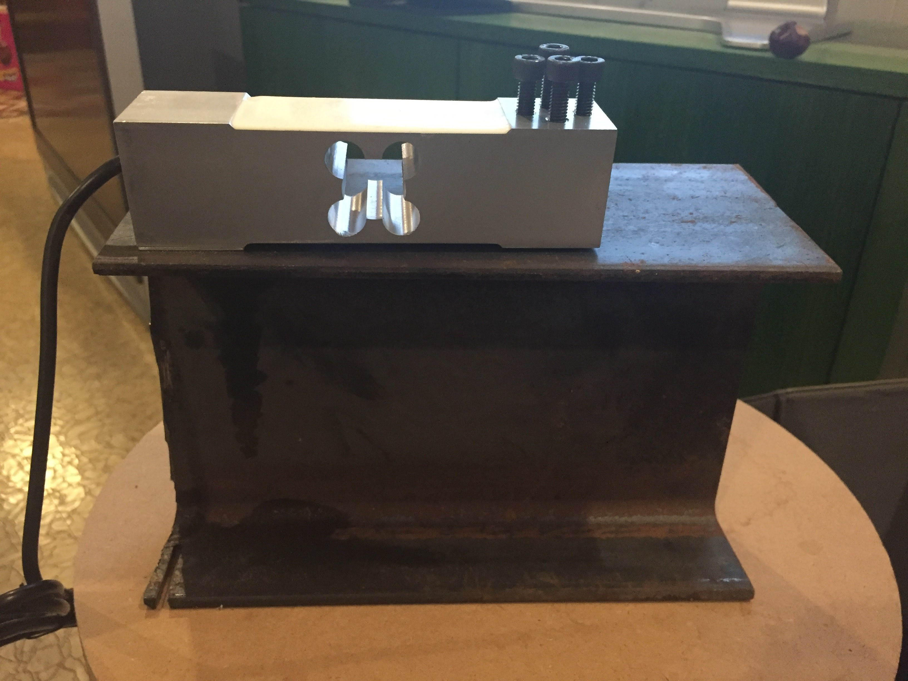

## Atmega328 based test stand for rocket motors.

* reads HX711 interface for load cell tracking at 80hz
* writes force readings to SD card
* beeper to signal countdown
* FET to light the igniter
* LCD for calibration

Status: Loadcell Mounted on I-Beam

LCD library:
https://github.com/adafruit/Adafruit-RGB-LCD-Shield-Library

HX711:
https://github.com/bogde/HX711