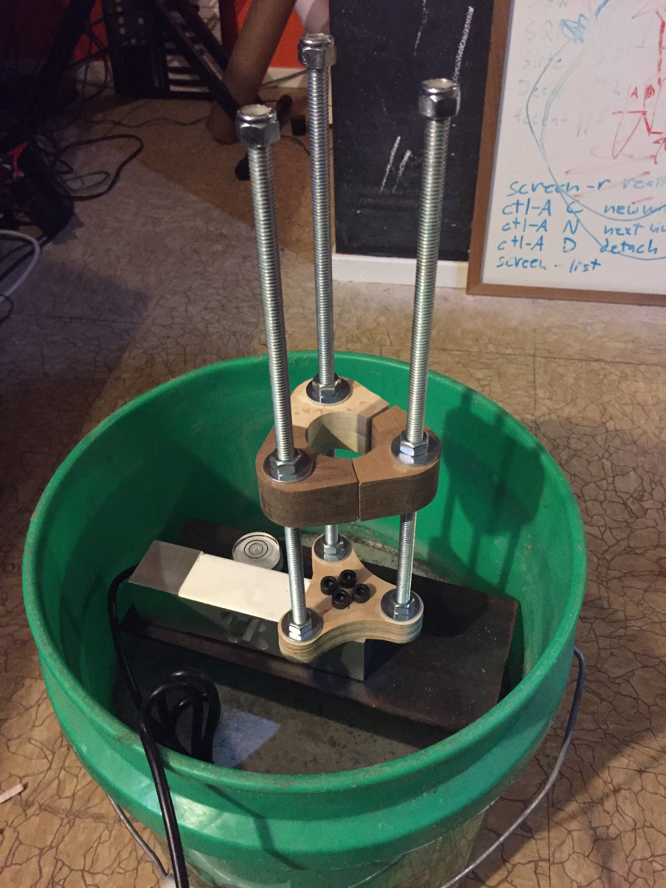

## Atmega328 test stand for rocket motors.

Based on the ["Ultra Simple Bucket Stand"](http://aeroconsystems.com/cart/test-stand-pictorial)

* Rotary Encoder + button + LCD interface
* reads HX711 interface for load cell tracking at 80hz
* writes force readings to SD card
* beeper to signal countdown
* FET to light the igniter

2/19/17 Motor holder bolted on

2/9/17 Status: Loadcell Mounted on I-Beam

### Dependencies

LCD library:
[https://github.com/adafruit/Adafruit-RGB-LCD-Shield-Library](https://github.com/adafruit/Adafruit-RGB-LCD-Shield-Library)

HX711:
[https://github.com/bogde/HX711](https://github.com/bogde/HX711)